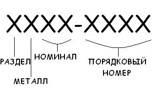

# Каталожный номер Банка России

Каталожный номер Банка России - символьная строка, состоящая из 9 знаков (символов) в которой закодирована информация о монете. Его структура представлена ниже:

В поле **Раздел** находится целое число в промежутке от 1 до 5, которое соответствует одному из разделов и является его кодом. В поле **Металл** находится целое число в промежутке от 0 до 6, которое соответствует одному из металлов и является его кодом. В поле **Номинал** находится целое двузначное число от 0 до 24. Каждое число соответствует определенному номиналу и является его идентификатором. В поле **Прочерк** находится разделительный символ " - ", разделяющий идентификационные данные монеты с ее номером. Сразу после разделительного символа следует поле **Порядковый номер**, в котором содержится четырехзначное число, являющееся порядковым номером монеты по данному разделу. Расшифровка чисел в полях каталожного номера следующая:

### Разделы:
- **1** - Курсовые монеты РСФСР 1921 - 1923 гг.
- **2** - Курсовые монеты РСФСР 1924 - 1991 гг.
- **3** - Памятные и инвестиционные монеты СССР 1924 - 1991 гг.
- **4** - Курсовые монет Российской Федерации с 1992 года.
- **5** - Памятные и инвестиционные монеты Российской Федерации с 1992 года.

### Металлы:
- **0** - Медно-никелевые сплавы
- **1** - Серебро
- **2** - Золото
- **3** - Платина
- **4** - Палладий
- **5** - Прочие
- **6** - Золото и серебро
- **7** - Сталь с латунным гальваническим покрытием

### Номиналы:
- **00** - полкопейки
- **01** - 1 копейка
- **02** - 2 копейки
- **03** - 3 копейки
- **04** - 5 копеек
- **05** - 10 копеек
- **06** - 15 копеек
- **07** - 20 копеек
- **08** - 50 копеек
- **09** - 1 рубль
- **10** - 2 рубля
- **11** - 3 рубля
- **12** - 5 рублей
- **13** - червонец
- **14** - 10 рублей
- **15** - 25 рублей
- **16** - 50 рублей
- **17** - 100 рублей
- **18** - 150 рублей
- **19** - 200 рублей
- **20** - 1000 рублей
- **21** - 10000 рублей
- **22** - 20 рублей
- **23** - 500 рублей
- **24** - 5000 рублей
- **25** - 25000 рублей
- **26** - 50000 рублей

Например, если мы имеем номер 5111-0198, то о монете можно сказать следующее: это Памятная монета Российской Федерации, выпущенная после 1991 года, монета изготовлена из серебра и имеет номинал 3 рубля. Порядковый номер монеты по данному разделу - 198.