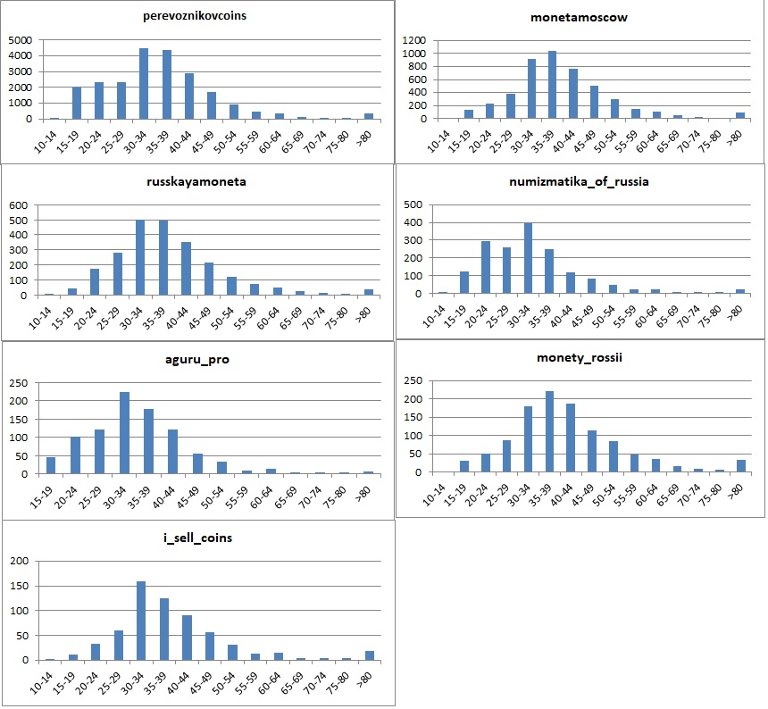
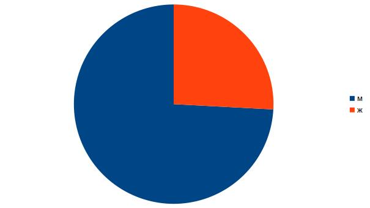
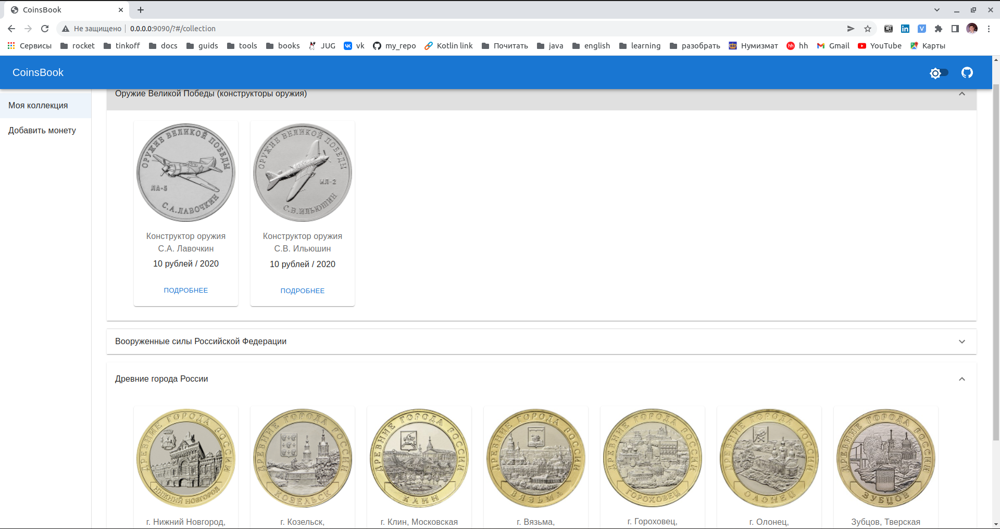
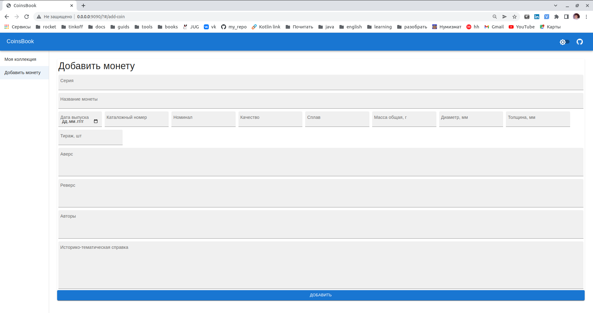

# Приложение для работы с коллекционными монетами *CoinsBook*

Учебный проект курса [Kotlin Backend Developer](https://otus.ru/lessons/kotlin/?int_source=courses_catalog&int_term=programming).
*CoinsBook* - это площадка, на которой пользователи управляют своей коллекцией монет, выставляют предложения на обмен 
или продажу монет и выставляют свои потребности в недостающих монетах. Задача площадки - предоставить удобный способ для
обмена монетами, покупки монет, управления коллекцией монет пользователя.

## Основной функционал
1. Пользователь может вести учет своей коллекции монет.
2. Админ может добавлять/изменять монеты в каталоге монет.
3. Пользователи могут обмениваться монетами друг с другом.
4. Пользователь может увидеть у кого есть недостающая монета и связаться с другим пользователем для обмена/продажи.
5. Пользователь может купить недостающую монету в магазине-партнере.

## Целевая аудитория

### Магазин партнер
- Магазину нужна площадка, где продавать монеты
- Может понадобиться аналитика по пользователям, регионам, чего хотят пользователи
- боли продавцов
  - реклама
  - база *горячих* пользователей
  - сложность разработки/поддержки собственного интернет магазина

### Администратор системы
- Администратору нужен удобный интерфейс для добавления каталогов монет
- Инструмент для просмотра статистики
- Инструмент для построения отчетов

### Пользователь системы.

Пользователь системы - это клиент, который ведет учет своих монет в приложении.

Целевую аудиторию пользователей системы определял анализируя различные сообщества нумизматов в VK. Был проведен анализ 
следующих VK групп:  
- aguru_pro
- numizmatika_of_russia
- perevoznikovcoins
- russkayamoneta
- monetamoscow
- monety_rossii
- i_sell_coins

Для определения целевой аудитории по возрасту было проанализировано 38334 пользователя. Были получены следующие данные:

Можно выделить возрастную группу 30-45 лет.

Распределение пользователей на основе пола
- Мужчины - 49187 (74,15%)
- Женщины - 17147 (25,85%)

Распределение по городам
- Москва - 17,79%
- Санкт-Петербург - 8,14%
- Казань - 2,02%
- Новосибирск - 1,66%
- Киев - 1,63%
- Нижний Новгород - 1,49%

Боли пользователей
  - обмен монет
  - отслеживать свою коллекцию.
    - Видеть каких монет не хватает до полной серии
  - покупать монеты
  - обмениваться монетами

## Описание MVP
### Страницы приложения
1. коллекция монет пользователя

2. форма добавления монеты в каталог

### Функции (эндпониты)
1. CRUDS (create, read, update, delete, search) для монет
